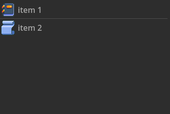
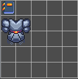
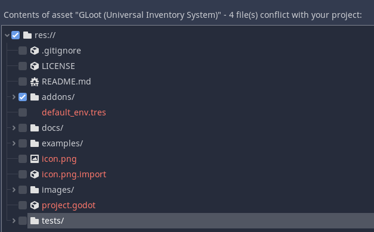
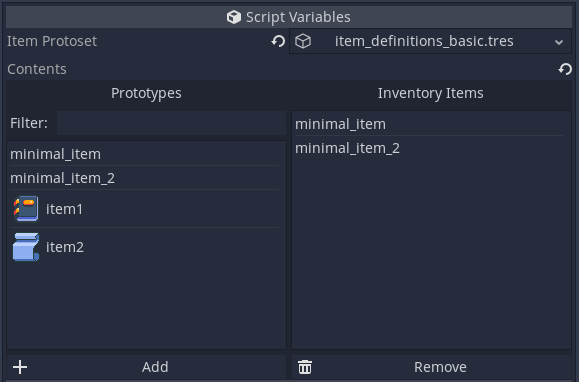
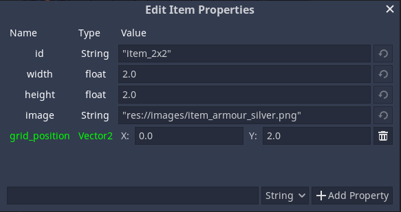

# GLoot

<p align="center">
  
</p>

A universal inventory system for the Godot game engine (version 4.4 and newer).

> NOTE: **Version 3.0 has been merged to `master`** and includes a number of changes that are not backwards-compatible with version 2.x. If you intend to upgrade from version 2 to version 3, there is a short [transition guide](docs/gloot_2_to_3_transition_guide.md) that will hopefully make the process smoother. If you, however, plan to stick to the old version, it can be found on the `v2.x` branch.

## Table of Contents

1. [Features](#features)
    1. [Inventory Item Class](#inventory-item-class)
    2. [Item Prototypes and Prototrees](#item-prototypes-and-prototrees)
    3. [Inventory Class](#inventory-class)
    4. [Inventory Constraints](#inventory-constraints)
    5. [Item Slots](#item-slots)
    6. [UI Controls](#ui-controls)
2. [Installation](#installation)
3. [Usage](#usage)
4. [Creating Item Prototypes](#creating-item-prototypes)
    1. [Minimal Prototree](#minimal-prototree)
    2. [`stack_size` and `max_stack_size`](#stack_size-and-max_stack_size)
    3. [Prototrees with Grid Constraint Properties](#prototrees-with-grid-constraint-properties)
    4. [Prototrees with Weight Constraint Properties](#prototrees-with-weight-constraint-properties)
    5. [Prototype Inheritance](#prototype-inheritance)
    6. [Editing Item Properties](#editing-item-properties)
5. [Serialization](#serialization)
6. [Documentation](#documentation)
7. [Examples](#examples)

## Features

### Inventory Item Class
The [`InventoryItem`](docs/inventory_item.md) class represents an item stack. All item stacks have a default stack size (and maximum stack size) of 1. Items can also have other properties that are based on item prototypes from a [prototype tree](#item-prototypes-and-prototrees).

### Item Prototypes and Prototrees

Prototypes define common properties for inventory items and items based on a prototype have the same properties as the prototype. They can also override some of those properties or define completely new ones that are not present in the prototype.

Prototypes can inherit other prototypes, forming a tree-like structure, i.e. a [`Prototree`](docs/prototree.md). Prototrees are defined in JSON format and are stored as a [JSON resource](https://docs.godotengine.org/en/stable/classes/class_json.html).

### Inventory Class
The  [`Inventory`](docs/inventory.md) class represents a basic inventory with basic inventory operations (adding, removing, transferring items etc.) and can be configured by adding various [inventory constraints](#inventory-constraints).

### Inventory Constraints
*  [`GridConstraint`](docs/grid_constraint.md) - Limits the inventory to a 2d grid of a given width and height.
*  [`WeightConstraint`](docs/weight_constraint.md) - Limits the inventory to a given weight capacity (the default unit weight of an item is 1).
*  [`ItemCountConstraint`](docs/item_count_constraint.md) - Limits the inventory to a given item count.

### Item Slots
The  [`ItemSlot`](docs/item_slot.md) class represents an item slot that can hold one inventory item.

### UI Controls
User interfaces are usually unique for each project, but it often helps to have some basic UI elements ready for earlier development phases and testing.
The following controls offer some basic interaction with various inventories:
*  [`CtrlInventory`](docs/ctrl_inventory.md) - Control node for displaying inventories as an [`ItemList`](https://docs.godotengine.org/en/stable/classes/class_itemlist.html).

    

*  [`CtrlInventoryCapacity`](docs/ctrl_inventory_capacity.md) - Control node for displaying inventory capacity as a progress bar (in case a `WeightConstraint` or an `ItemCountConstraint` is attached to the inventory).

    
    
*  [`CtrlInventoryGrid`](docs/ctrl_inventory_grid.md) - Control node for displaying inventories with a `GridConstraint` on a 2d grid.

    
    
*  [`CtrlItemSlot`](docs/ctrl_item_slot.md) - A control node representing an inventory slot (`ItemSlot`).
    
    

## Installation

1. Create an `addons` directory inside your project directory.
2. Get the plugin from the AssetLib or from GitHub
    * From the AssetLib: Open the AssetLib from the Godot editor and search for "GLoot". Click download and deselect everything except the `addons` directory when importing.

        

    * From GitHub: Run `git clone https://github.com/peter-kish/gloot.git` and copy the contents of the `addons` directory to your projects `addons` directory.
4. Enable the plugin in `Project Settings > Plugins`.

## Usage

1. Create a JSON resource that will hold all the item prototypes used by the inventory (see [Creating Item Prototypes](#creating-item-prototypes) below).
2. Create an `Inventory` node in your scene and set its `prototree_json` property (previously created).
3. (*Optional*) Add constraints as child nodes to the previously created inventory node.
3. Add items to the inventory from the inspector:

    

    Items can also be added from code, e.g. by calling `create_and_add_item()` to create and add items based on the given prototype path:
    ```gdscript
    inventory.create_and_add_item("melee_weapons/knife")
    ```
4. (*Optional*) Create item slots that will hold various items (for example the currently equipped weapon or armor).
5. Create some UI controls to display the created inventory and its contents.
6. Call `add_item()`, `remove_item()` etc. from your scripts to manipulate inventory nodes. Refer to [the documentation](https://github.com/peter-kish/gloot/tree/dev_v3.0.0/docs) for more details about the available properties, methods and signals for each class.

## Creating Item Prototypes

An item prototype is a set of item properties that all items based on that prototype will contain. Items based on a specific prototype can override these properties or add new properties that are not defined in the prototype.

Prototypes can inherit other prototypes, forming a tree-like structure, i.e. a `Prototree`. An item prototype is defined by its path in the prototree and its properties.

### Minimal Prototree

Prototrees are defined as JSON resources in which the tree is defined as a JSON object whose key-value pairs define the prototypes. The key represents the prototype ID, while the value is another object that represents the prototype properties.

Below is an example of a minimal prototree in JSON format:
```javascript
{
    // "minimal_item" with no properties:
    "minimal_item": {
    }
}
```

This prototree only contains one prototype named `minimal_item`, which has no properties.

### `stack_size` and `max_stack_size`

To define the stack size of an item prototype, use the `stack_size` property. If not defined, the stack size will be 1. Some GLoot functions that work with item stacks (e.g. `Inventory.split_stack` or `InventoryItem.split`) will manipulate this property.

Similar to `stack_size`, the `max_stack_size` defines the maximum stack size and its default value is 1.

Example:
```javascript
{
    // The default stack size and the default maximum stack size is 1:
    "watch": {},
    // A full deck of 52 cards:
    "deck_of_cards": {
        "stack_size": 52,
        "max_stack_size": 52
    },
    // Half a magazine of bullets:
    "pistol_bullets": {
        "stack_size": 12,
        "max_stack_size": 24
    }
}
```

### Prototrees with Grid Constraint Properties

A `GridConstraint` can interpret the following item properties:
* `size` (`Vector2i`) - Defines the width and height of the item. If not defined, the item size is `Vector2i(1, 1)`.
* `rotated` (`bool`) - If `true`, the item is rotated by 90 degrees. If not defined, the item is not rotated.
* `positive_rotation` (`bool`) - Indicates whether the item icon will be rotated by positive or negative 90 degrees. If not defined, the item is rotated by positive 90 degrees.

Example:
```javascript
{
    // The default item size is (1, 1):
    "1x1_knife": {},
    // The bombs will have a size of (2, 2):
    "2x2_bomb": {
        "size": "Vector2i(2, 2)"
    },
    // Spears will have a size of (1, 3), but will be be rotated to be
    // positioned horizontally (size.y becomes its width):
    "1x3_spear": {
        "size": "Vector2i(1, 3)",
        "rotated": "true"
    }
}
```

### Prototrees with Weight Constraint Properties

If an item is inside an inventory with a `WeightConstraint`, its `weight` property is interpreted as the (unit) weight of the item.

Example:
```javascript
{
    // The default item weight is 1 and the default stack size is 1.
    // The total stack weight is 1 * 1 = 1:
    "small_item": {},
    // The total stack weight is 1 * 20 = 20:
    "big_item": {
        "weight": 20
    },
    // The total stack weight is 10 * 2 = 20:
    "small_stackable_item": {
        "stack_size": 10,
        "max_stack_size": 10,
        "weight": 2
    }
}
```

### Prototype Inheritance

As already mentioned, a prototype can inherit properties from another prototype. The base of a derived prototype is defined using the `inherits` property. The derived prototypes can override properties from the base or define new properties.

Example:
```javascript
{
    // Base prototype for melee weapons.
    // Defines the "weapon_type" and "damage" properties:
    "melee_weapon": {
        "weapon_type": "melee",
        "damage": 1
    },
    // Inherits the "weapon_type" property ("melee").
    // Overrides the "damage" property (from 1 to 30):
    "axe": {
        "inherits": "melee_weapon",
        "damage": 30
    },
    // Inherits the "weapon_type" property ("melee").
    // Overrides the "damage" property (from 1 to 10) and adds an
    // item description:
    "knife": {
        "inherits": "melee_weapon",
        "damage": 10,
        "description": "A standard kitchen knife."
    }
}
```

### Editing Item Properties

Item properties defined in the prototree can additionally be overridden by each individual item that uses that prototree. Use the `set_property()` method to set/override property values, or the `clear_property()` to clear them:

Example:
```gdscript
# Decrease the size of an item stack by 1
var stack_size: int = item.get_property("stack_size")
if stack_size > 0:
    item.set_property("stack_size", stack_size - 1)
```

Item properties can also be modified and overridden from the editor:


To open the item editor select an inventory node, select an item in the inspector and press the "Edit" button.
Properties marked with green in the item editor represent overridden properties.

## Serialization

All GLoot classes have a `serialize()` and a `deserialize()` method that can be used for serialization. The `serialize()` methods serializes the class into a dictionary, which can be further serialized into JSON, binary or some other format.

Example:
```gdscript
# Serialize the inventory into a JSON string
var inventory: Inventory = get_node("inventory")
var dict: Dictionary = inventory.serialize()
var json: String = JSON.stringify(dict)
```

The `deserialize()` methods receive a dictionary as argument that has been previously generated with `serialize()` and apply the data to the current class instance.

Example:
```gdscript
# Deserialize the inventory from a JSON string
var inventory: Inventory = get_node("inventory")
var res: JSONParseResult = JSON.parse(json)
if res.error == OK:
    var dict = res.result
    inventory.deserialize(dict)
```

## Documentation

The documentation can be found [here](https://github.com/peter-kish/gloot/tree/dev_v3.0.0/docs).

## Examples

Some example scenes can be found in the [examples](examples/README.md) directory.