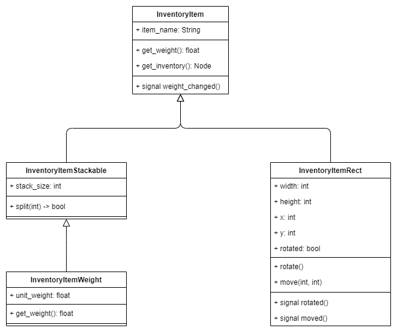
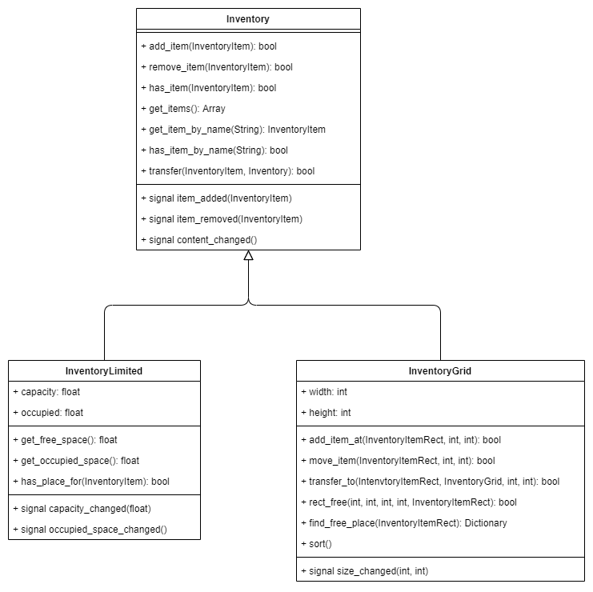

# Godot Inventory System

An universal inventory system for the Godot game engine (version 3.x and newer).

## Features

### Inventory Items

*  `InventoryItem` - Basic inventory item class. Has a constant weight of 1.0.
*  `InventoryItemStackable` - Represents a stack of inventory items. Item stacks can be split up and joined together. The total weight of a stack equals its size (since each item has a weight of 1.0). Inherits InventoryItem.
*  `InventoryItemWeight` - Represents a stack of items that have a predefined weight. The total weight of a stack equals its size multiplied by the weight of the item. Inherits InventoryItemStackable.
*  `InventoryItemRect` - Inventory item that takes up a predefined amount of 2d space in a grid-based inventory (see `InventoryGrid` below). The size of the item is defined by its weight and height, while its position is defined by x and y coordinates. Rectangular items can also be rotated by 90 degrees for easier inventory organization. In case the item has been rotated, its width and height values are swapped and its "rotated" flag is set. Inherits InventoryItem.

### Inventory Types

*  `Inventory` - Basic inventory class. Supports basic inventory operations (adding, removing, transferring items etc.). Can contain an unlimited amount of items.
*  `InventoryLimited` - Has a limited item capacity in terms of weight. Inherits Inventory.
*  `InventoryGrid` - Has a limited item capacity in terms of space. The inventory capacity is defined by its width and height. Can only contain `InventoryItemRect` items.

### Item Slots

*  `ItemSlot` - Holds a reference to a given item from a given inventory. The slot can be cleared or bound to one item at a time. In case the item is removed from the inventory or the slot is bound to a different inventory, the slot is automatically cleared.

## How to install

1. Create an `addons` directory inside your project directory.
2. Run `git clone` from the `addons` directory.
3. Enable the plugin in `Project Settings > Plugins`.
4. Done.

## How to use

* Create an inventory node inside a scene and create items as child nodes to add them to the inventory. Pay attention to the inventory capacity to avoid assertions when the scene is loaded.
* Optionally, create item slots that will hold various items (for example the currently equipped weapon or armor).
* Call `add_item()`, `remove_item()` or `transfer_item()` from your scripts to move items around multiple inventory nodes. Refer to the class diagrams for more details about the available properties, methods and signals for each class.

## Class Diagrams

## Examples

TODO