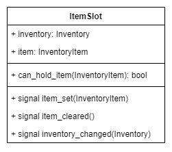

# Godot Inventory System

An universal inventory system for the Godot game engine (version 3.x and newer).

## Features

### Item Definitions

*  `ItemDefinitions` - A resource type holding an array of inventory item prototypes in JSON format.

### Inventory Items

*  `InventoryItem` - Basic inventory item class. Nameless, weightless and shapeless.
*  `InventoryItemStackable` - Represents a stack of inventory items. Item stacks can be split up and joined together. The total weight of a stack equals its size multiplied by the unit weight of the item. Inherits InventoryItem.
*  `InventoryItemRect` - Inventory item that takes up a predefined amount of 2d space in a grid-based inventory (see `InventoryGrid` below). The size of the item is defined by its weight and height, while its position is defined by x and y coordinates. Rectangular items can also be rotated by 90 degrees for easier inventory organization. In case the item has been rotated, its width and height values are swapped and its "rotated" flag is set. Inherits InventoryItem.

### Inventory Types

*  `Inventory` - Basic inventory class. Supports basic inventory operations (adding, removing, transferring items etc.). Can contain an unlimited amount of items.
*  `InventoryStacked` - Contains `InventoryItemStackable` items and has a limited item capacity in terms of weight. Inherits Inventory.
*  `InventoryGrid` - Contains `InventoryItemRect` items and has a limited capacity in terms of space. The inventory capacity is defined by its width and height. Inherits Inventory.

### Item Slots

*  `ItemSlot` - Holds a reference to a given item from a given inventory. The slot can be cleared or bound to one item at a time. In case the item is removed from the inventory or the slot is bound to a different inventory, the slot is automatically cleared.

### UI Controls

*  `CtrlInventory` - UI control representing a basic `Inventory`. Displays a list of items in the inventory.
*  `CtrlInventoryStacked` - UI control representing a stack based inventory (`InventoryStacked`). It lists the contained items and shows an optional progress bar displaying the capacity and fullness of the inventory.
*  `CtrlInventoryGrid` - UI control representing a grid based inventory (`InventoryGrid`). Displays a grid based on the inventory capacity (width and height) and the contained items on the grid. The items can be moved around in the inventory by dragging.

## Installation

1. Create an `addons` directory inside your project directory.
2. Run `git clone` from the `addons` directory.
3. Enable the plugin in `Project Settings > Plugins`.

## Usage

1. Create an `ItemDefinitions` resource that will hold all the item prototypes used by the inventory. The resource has a single property `json_data` that holds all item prototype information in JSON format.
2. Create an inventory node in your scene. Set its capacity if needed (required for `InventoryStacked` and `InventoryGrid`) and set its `item_definitions` property (previously created).
3. To add items to the inventory set its `contents` property. List the prototype IDs of the items that you want added to the inventory.
    **NOTE**: Pay attention to the inventory capacity to avoid assertions when the scene is loaded.
4. (*Optional*) Create item slots that will hold various items (for example the currently equipped weapon or armor).
5. Create some UI controls to display the created inventory and its contents.
6. Call `add_item()`, `remove_item()`, `transfer_item()` etc. from your scripts to move items around multiple inventory nodes. Refer to the class diagrams for more details about the available properties, methods and signals for each class.

## Creating Item Definitions

Item definitions represent a number of item prototypes based on which future inventory items will be created.
It also defines the type of the inventory these items will be contained in.

### Minimal Item Definition JSON

There are a few requirements each item definitions JSON must fulfill:

* The JSON must be a JSON object.
* The JSON must contain the `inventory_type` property. It represents the type of inventory the items prototypes are defined for. It can have on of the following values:
    * `basic` - for basic inventories (`Inventory`)
    * `stack` - for stack based inventories (`InventoryStacked`)
    * `grid` - for grid based inventories (`InventoryGrid`)
* The JSON must also contain the `items_prototypes` array.
* Each `items_prototypes` element must contain the `id` property uniquely identifying the prototype.

Below is an example of a minimal item definitions JSON:

```json
{
    "inventory_type": "basic",
    "items_prototypes": [
        {
            "id": "minimal_item"
        }
    ]
}
```

### Item Definitions for a Stack Based Inventory

Prototypes of items contained in stack based inventories support the following additional properties:

* `default_stack_size` - Defines the default stack size of the item. Newly created items that use this prototype will have this stack size. Has the value of 1 if not defined.
* `weight` - Defines the unit weight of the item. Has the value of 1.0 if not defined.
    **NOTE**: The total weight of an item is defined as its unit weight multiplied by its stack size.

Example:
```json
{
    "inventory_type": "stack",
    "items_prototypes": [
		{
		    "id": "stackable_item",
			"default_stack_size": 10
		},
        {
            "id": "heavy_item",
		    "weight": 20
        },
        {
		    "id": "very_heavy_item",
			"default_stack_size": 10
            "weight": 20
		}
    ]
}
```

### Item Definitions for a Grid Based Inventory

Prototypes of items contained in stack based inventories support the following additional properties:

* `width` - Defines the width of the item. Has the value of 1 if not defined.
* `height` - Defines the height of the item. Has the value of 1 if not defined.

Example:
```json
{
    "inventory_type": "grid",
    "items_prototypes": [
        {
            "id": "1x1_knife",
			"width": 1,
			"height": 1
        },
        {
            "id": "1x3_spear",
			"width": 1,
			"height": 3
        },
        {
            "id": "2x2_bomb",
			"width": 2,
			"height": 2
        },
    ]
}
```

### Additional Prototype Fields

Apart from the previously mentioned properties, item prototypes can hold all kinds of additional user-defined data. Properties like item name or item description are often used and can be easily added alongside the predefined properties.

Example:
```json
{
    "inventory_type": "stack",
    "item_prototypes": [
        {
            "id": "knife_01",
            "weight": "2.0",
            "name": "Kitchen Knife",
            "description": "A knife intended to be used in food preparation."
        }
    ]
}
```

Any of the item properties can be access from code through the `item_definitions` property of the `Inventory` classes:
```python
var item_definitions = item.get_inventory().item_definitions
var item_name = ""
if item_definitions.has("name"):
    item_name = item_definitions["name"]
var item_description = ""
if item_definitions.has("description"):
    item_description = item_definitions["description"]
```

## Extending Functionality

TODO:
* Inheriting from InventoryItem
* Inheriting from Inventory

## The API

TODO

## Class Diagrams





## Examples

Take a look at the `examples` directory for some example scenes:
* `inventory_transfer.tscn` - Displaying two basic inventories (`Inventory`) and transferring items between them.
* `inventory_stacked_transfer.tscn` - Displaying two stack based inventories (`InventoryStacked`) and transferring items between them.
* `inventory_grid_transfer.tscn` - Displaying two grid based inventories (`InventoryGrid`) and transferring items between them using drag and drop.