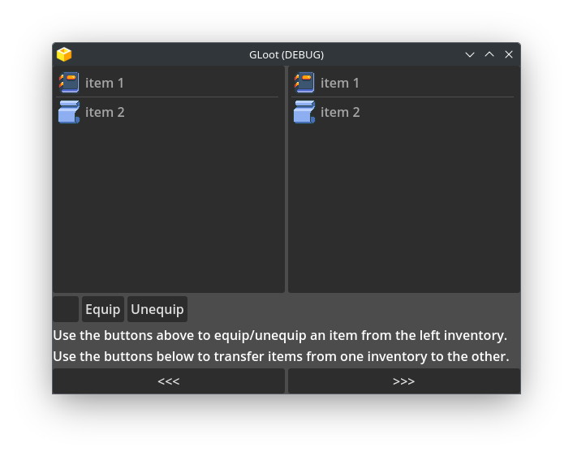
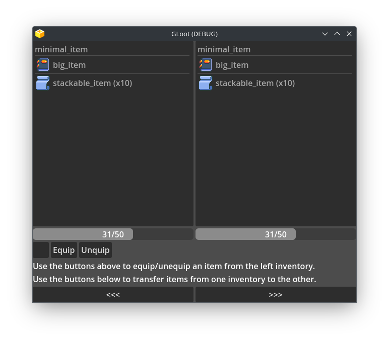
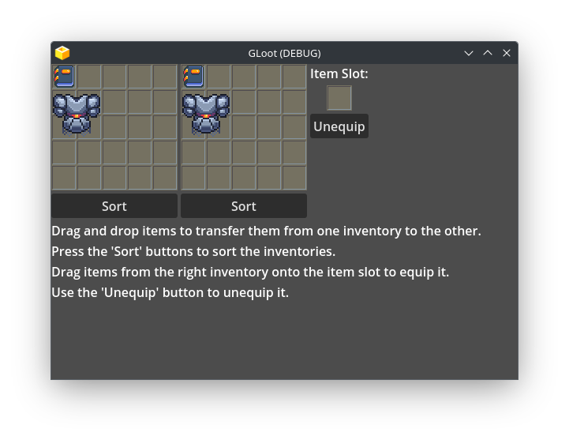
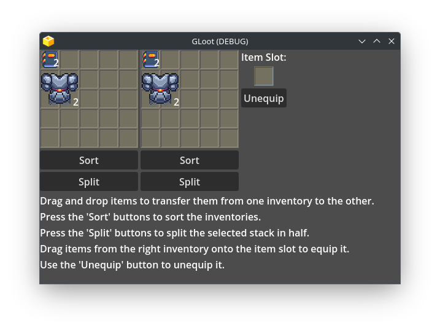

# Examples

This directory contains a few example scenes:

* `inventory_transfer.tscn` - Displaying two basic inventories (`Inventory`) and transferring items between them.
    
* `inventory_stacked_transfer.tscn` - Displaying two inventories (`Inventory`) with item stacks and weight constraints (`WeightConstraint`) and transferring items between them.
    
* `inventory_grid_transfer.tscn` - Displaying two inventories (`Inventory`) with grid constraints (`GridConstraint`) and transferring items between them.
    
* `inventory_grid_stacked_transfer.tscn` - A combination of the previous two examples: displaying two inventories (`Inventory`) with grid and weight constraints, and transferring items between them.
    
